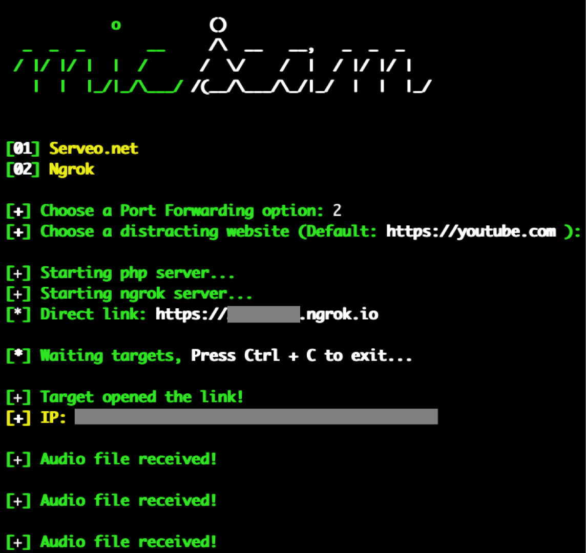

# micScam

A tool to access the microphone of victim's device and get the audio files (4 secs .wav files) by sharing a link.

## Instagram: https://instagram.com/programemerz



### Features:

#### Microphone access to windows, android, iPhone
#### Port Forwarding by Ngrok
#### IP Tracker

## Legal disclaimer:

Usage of micScam for attacking targets without prior mutual consent is illegal. It's the end user's responsibility to obey all applicable local, state and federal laws. Developers assume no liability and are not responsible for any misuse or damage caused by this program. 

### Usage:
```
git clone https://github.com/programemers/micscam
cd micscam
bash micscam.sh
```
